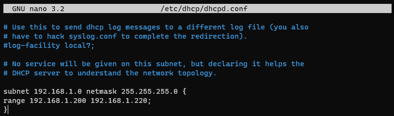
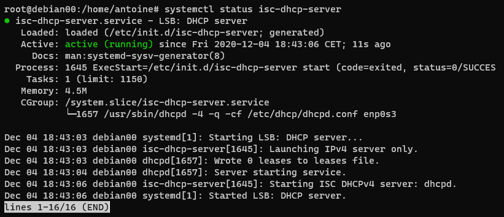

# Configurer un serveur DHCP sur Debian 10 (Buster)

## Kézako ?

Un serveur DHCP a pour but de délivrer automatiquement une configuration IP valide aux divers équipements qui se connectent sur un réseau.

Pour rappel, un serveur DHCP doit déliver impérativement ces 3 choses au client: 
- Une adresse IP
- Un temps de bail, c'est à dire une durée de validité de l'adresse IP donnée
- Un masque de sous réseau, sans quoi l'adresse IP est inexploitable   

Optionnellement, un serveur DHCP peut distribuer l'adresse d'un serveur DNS, ce que nous ferons; mais aussi une passerelle.

## Prérequis

- Installation Debian fonctionnelle
- Configuration et/ou interface réseau fonctionnelle avec un accès à Internet
- Accès Root  
Pour l'avoir, taper simplement: `su` (super user) suivi du mot de passe du compte root.

> Avant d'éditer chaque fichier, nous en ferons une sauvegarde afin de pouvoir retrouver un fichier exploitable en cas de pepin.  
> Nous ferons simplement une copie du fichier en rajoutant un ``.old``

## Installation d'ISC DHCP Server:
Mettre à jour la liste des paquets:  
``apt update``  

Puis installer:  
``apt install isc-dhcp-server``

Un message d'erreur provenant du serveur DHCP s'affichera juste à la fin de l'installation. 
Le serveur a en effet essayé de démarrer mais n'a pas pu, ce qui est tout à fait normal puisqu'il n'est pas encore été configuré.

## Indiquer l'interface à utiliser

Backup:  
``cp /etc/default/isc-dhcp-server /etc/default/isc-dhcp-server.old``

Éditer le fichier:  
``nano /etc/default/isc-dhcp-server``

Il faudra vers le bas de celui-ci ajouter le nom de l'interface réseau à utiliser.  
Exemple avec enp0s3:

Quitter avec CTRL+X, puis confirmer pour écraser le fichier.

## Spécifier les options du DHCP
Backup:  
``cp /etc/dhcp/dhcpd.conf /etc/dhcp/dhcpd.conf.old``

Éditer le fichier:  
``nano /etc/dhcp/dhcpd.conf``

Nous allons seulement changer les options qui seront vraiment nécessaires pour que le DHCP puissse tourner:

## Définir le DNS distribué par le DHCP
Vers le haut du fichier ``dhcpd.conf``, il sera possible de définir un nom de domaine et un DNS.
Nous mettrons un domaine en ``quelquechose.local`` et un DNS comme ``1.1.1.1``, celui de CloudFlare.   
Les DNS doivent être séparés par une virgule si l'on souhaite en mettre plusieurs:

Il est possible de modifier les temps de bail (``default-lease-time`` et ``max-lease-time``). Ce temps est donné en secondes et est de 600 par défaut.

## Définir l'IP réseau et le masque de sous-réseau
Nous allons décommenter (retirer les #) autour de la ligne 30 de sorte à avoir ceci:

Nous pouvons ensuite sur cette ligne (la seule en blanche sur l'image) changer l'adresse IP et le masque pour correspondre à notre réseau.

## Plage d'IP à distribuer
Nous allons ajouter cette option sur une nouvelle ligne entre les crochets. Elle se présente ainsi:  
``range adresse_IP_début adresse_IP_fin;``  

En sachant que les adresses IP début et fin sont distribuées.

> Ne pas oublier le point virgule ( ; ) en fin de ligne !

Le résultat devrait ressembler à ceci:

Écraser le fichier, et confirmer.

## Verdict...

Redémarrer le serveur avec:  
``systemctl restart isc-dhcp-server``

Regarder si le serveur est fonctionnel avec:  
``systemctl status isc-dhcp-server``

Félicitations, ton serveur DHCP fonctionne ! 🎉🎉🎉

## Ça ne marche pas ?

Regarder dans les logs à partir du bas pour voir ce qui ne va pas:
``tail -n 25 /var/log/syslog``

``tail`` Permet d'afficher à partir du bas du fichier (en l'occurence, le fichier log peut-être TRÈS LONG).  
``-n`` Spécifie le nombre de lignes à récupérer